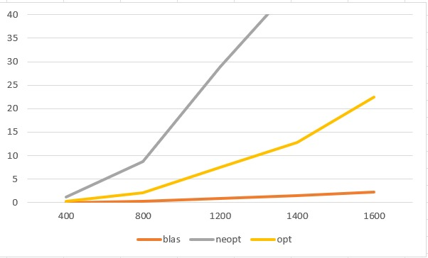

tema 2 - asc David Mihalcenco 331CB
===================================
## Solver_Blas
Am folosit functia dgemm pentru a inmulti functiile Bt si Bt cu flagurile activate transpose.
Am folosit dtrmm pentru a face inmultirile cu matricea superior triunghiulara, am folosit flagurile necesare.
Am folosit functia daxpy pentru a aduna.
Rezultatele: 
```
BLAS SOLVER
Run=./tema2_blas: N=400: Time=0.033603
BLAS SOLVER
Run=./tema2_blas: N=800: Time=0.442316
BLAS SOLVER
Run=./tema2_blas: N=1200: Time=0.936372
```

## Solver_Neopt
Am realizat totul in mod clasic doar folosind for.
Am alocat spatii pentru fiecare rezultat a unui for.
Am facut aceleasi operatii ca si la solver blas.
Am eliberat memoria folosita
```
NEOPT SOLVER
Run=./tema2_neopt: N=400: Time=0.770664
NEOPT SOLVER
Run=./tema2_neopt: N=800: Time=6.932299
NEOPT SOLVER
Run=./tema2_neopt: N=1200: Time=24.886959
```

# Solver_Opt
Am urmarit aceeasi pasi ca la varianta neoptimizata.
Diferentele sunt ca folosesc pointeri care optimizeaza accesul la memorie, de asemenea folosesc
registri, astfel nu se acceseaza mereu memoria din matrice.
Aici am aflat si B_t pentru a fi mai usor in calcule, n-am calculat A_t pentru ca nu are sens, 
am parcurs liniile deoarece este echivalent cu parcurgerea coloanelor.
La efectuarea operatiei `Bt * Bt`, m-am folosit de B_t care a fost calculat mai sus, si am 
inmultit simplu 2 matrici.
```
OPT SOLVER
Run=./tema2_opt_m: N=400: Time=0.317528
OPT SOLVER
Run=./tema2_opt_m: N=800: Time=2.565656
OPT SOLVER
Run=./tema2_opt_m: N=1200: Time=7.422169
```

# CHECK_MEMORY
Am rulat fiecare test folosind comanda `valgrind --tool=memcheck --leak-check=full` si
am observat ca nici intr-un fisier nu sunt memory leak-uri: `All heap blocks were freed -- no leaks are possible`.

# CHEACK_CACHE
Am rulat fiecare test folosind comanda `valgrind --tool=cachegrind --branch-sim=yes`.

```
refs: numarul total de referinte (accesari) la memorie realizate de program

I1 misses: numarul de pierderi de cache de nivelul 1 pentru instructiuni (cod)

LLi misses: numarul de pierderi de cache de nivelul final pentru instructiuni (cod)

I1 miss rate: rata de pierdere de cache pentru instructiuni (calculata ca I1 misses / refs)

LLi miss rate: rata de pierdere de cache pentru instructiuni (calculata ca LLi misses / refs)

D refs: numarul total de referinte (accesari) la memorie pentru date (variabile, matrici etc.)

D1 misses: numarul de pierderi de cache de nivelul 1 pentru date

LLd misses: numarul de pierderi de cache de nivelul final pentru date

D1 miss rate: rata de pierdere de cache pentru date (calculata ca D1 misses / D refs)

LLd miss rate: rata de pierdere de cache pentru date (calculata ca LLd misses / D refs)

LL refs: numarul total de referinte (accesari) la memorie pentru date si instructiuni

LL misses: numarul total de pierderi de cache de nivelul final pentru date si instructiuni

LL miss rate: rata de pierdere de cache pentru date si instructiuni (calculata ca LL misses / LL refs)

Branches: numarul total de ramificari realizate de program (de exemplu, instructiuni "if", "for", "while")

Mispredicts: numarul de predictii gresite ale ramificarii

Mispred rate: rata de predictii gresite ale ramificarii (calculata ca Mispredicts / Branches)

```

### NEOPTIMIZATA

```
==2920338==
==2920338== I   refs:      5,924,923,316
==2920338== I1  misses:            1,633
==2920338== LLi misses:            1,550
==2920338== I1  miss rate:          0.00%
==2920338== LLi miss rate:          0.00%
==2920338==
==2920338== D   refs:      2,962,907,162  (2,831,842,838 rd   + 131,064,324 wr)
==2920338== D1  misses:       98,243,377  (   98,172,135 rd   +      71,242 wr)
==2920338== LLd misses:          113,272  (       62,182 rd   +      51,090 wr)
==2920338== D1  miss rate:           3.3% (          3.5%     +         0.1%  )
==2920338== LLd miss rate:           0.0% (          0.0%     +         0.0%  )
==2920338==
==2920338== LL refs:          98,245,010  (   98,173,768 rd   +      71,242 wr)
==2920338== LL misses:           114,822  (       63,732 rd   +      51,090 wr)
==2920338== LL miss rate:            0.0% (          0.0%     +         0.0%  )
==2920338==
==2920338== Branches:        132,233,899  (  131,993,210 cond +     240,689 ind)
==2920338== Mispredicts:         501,834  (      501,593 cond +         241 ind)
==2920338== Mispred rate:            0.4% (          0.4%     +         0.1%   )
```

Prima sectiune furnizeaza informatii despre accesarile si pierderile de cache pentru instructiuni, inclusiv numarul de referinte, pierderi si rate de pierdere pentru atat cache-ul de instructiuni L1 (I1), cat si cache-ul de ultim nivel pentru instructiuni (LLi). In acest caz, raportul indica ca nu exista pierderi pentru acestea.

A doua sectiune se refera la accesarile si pierderile de cache pentru date (D), precum si la accesarile si pierderile de cache pentru ultimul nivel (LLd). De asemenea, se furnizeaza ratele de pierdere pentru acestea. Raportul indica ca ratele de pierdere pentru acestea sunt relativ mici, cu o rata de pierdere de 3,3% pentru cache-ul de date de nivel 1 si 0,0% pentru cache-ul de date de ultim nivel.

Urmatoarea sectiune furnizeaza informatii despre branch-uri si predictii gresite, precum si rata de predictii gresite pentru acestea. Raportul indica ca exista un numar mare de branch-uri si predictii gresite, dar rata de predictii gresite este relativ mica, fiind de 0,4%.

### OPTIMIZATA

```
==2921203==
==2921203== I   refs:      1,605,184,832
==2921203== I1  misses:            1,621
==2921203== LLi misses:            1,540
==2921203== I1  miss rate:          0.00%
==2921203== LLi miss rate:          0.00%
==2921203==
==2921203== D   refs:        461,948,380  (458,885,640 rd   + 3,062,740 wr)
==2921203== D1  misses:       76,806,733  ( 76,395,491 rd   +   411,242 wr)
==2921203== LLd misses:          133,273  (     22,182 rd   +   111,091 wr)
==2921203== D1  miss rate:          16.6% (       16.6%     +      13.4%  )
==2921203== LLd miss rate:           0.0% (        0.0%     +       3.6%  )
==2921203==
==2921203== LL refs:          76,808,354  ( 76,397,112 rd   +   411,242 wr)
==2921203== LL misses:           134,813  (     23,722 rd   +   111,091 wr)
==2921203== LL miss rate:            0.0% (        0.0%     +       3.6%  )
==2921203==
==2921203== Branches:        132,394,757  (132,154,058 cond +   240,699 ind)
==2921203== Mispredicts:         502,269  (    502,026 cond +       243 ind)
==2921203== Mispred rate:            0.4% (        0.4%     +       0.1%   )
```

In ceea ce priveste statistica referitoare la cache, se poate observa ca programul are o rata de rata de misses (D1 miss rate) de 16,6% pentru accesurile la cache de nivelul 1 pentru date (D), ceea ce sugereaza o performanta relativ buna. In ceea ce priveste accesurile la cache de nivelul 2 pentru date (LLd), programul are o rata de misses de 0,0% pentru accesurile de citire (rd) si o rata de misses de 3,6% pentru accesurile de scriere (wr).

In ceea ce priveste accesurile la cache de nivelul 1 pentru instructiuni (I), programul are o rata de misses de 0,00% pentru accesurile de tip I1 si o rata de misses de 0,00% pentru accesurile la cache de nivelul 2 pentru instructiuni (LLi).

In ceea ce priveste predicțiile de branch-uri, programul are o rata de mispredicts de 0,4%, care este destul de buna. In general, rezultatele indica faptul ca programul ruleaza in mod eficient si ca are o performanta buna in ceea ce priveste accesurile la cache.

### BLAS
```
==2921274==
==2921274== I   refs:      250,893,509
==2921274== I1  misses:         23,230
==2921274== LLi misses:          3,486
==2921274== I1  miss rate:        0.01%
==2921274== LLi miss rate:        0.00%
==2921274==
==2921274== D   refs:       93,632,319  (87,829,265 rd   + 5,803,054 wr)
==2921274== D1  misses:      1,638,814  ( 1,364,519 rd   +   274,295 wr)
==2921274== LLd misses:         93,541  (    11,731 rd   +    81,810 wr)
==2921274== D1  miss rate:         1.8% (       1.6%     +       4.7%  )
==2921274== LLd miss rate:         0.1% (       0.0%     +       1.4%  )
==2921274==
==2921274== LL refs:         1,662,044  ( 1,387,749 rd   +   274,295 wr)
==2921274== LL misses:          97,027  (    15,217 rd   +    81,810 wr)
==2921274== LL miss rate:          0.0% (       0.0%     +       1.4%  )
==2921274==
==2921274== Branches:        4,571,136  ( 4,315,140 cond +   255,996 ind)
==2921274== Mispredicts:        71,972  (    71,042 cond +       930 ind)
==2921274== Mispred rate:          1.6% (       1.6%     +       0.4%   )
```

Pentru accesurile la cache de nivelul 1 pentru date (D1), programul are o rata de misses de 1,8%, ceea ce sugereaza o performanta buna, cu 1,6% pentru accesurile de citire (rd) si 4,7% pentru accesurile de scriere (wr). In ceea ce priveste accesurile la cache de nivelul 2 pentru date (LLd), programul are o rata de misses de 0,1%, cu 0,0% pentru accesurile de citire (rd) si 1,4% pentru accesurile de scriere (wr).

Pentru accesurile la cache de nivelul 1 pentru instructiuni (I1) si cache-ul de nivelul 2 pentru instructiuni (LLi), programul are o rata de misses foarte mica, de 0,01% respectiv 0,00%.

Pentru predictiile de branch-uri, programul are o rata de mispredicts de 1,6%, ceea ce sugereaza o performanta destul de buna.

In general, aceste statistici indica faptul ca programul are o performanta buna in ceea ce priveste accesurile la cache si predicțiile de branch-uri.

### EXPLICATII PRIVIND EFECTUL OPTIMIZARILOR FACUTE IN VARIANTA OPT_M

Statisticile afisate indica faptul ca programul a fost optimizat cu succes prin utilizarea pointerilor pentru acesarea valorilor din matrici si prin utilizarea registrilor. Accesurile la cache si predictiile de branch-uri au o rata buna de succes, ceea ce sugereaza o performanta buna a programului in general. De asemenea, s-au facut optimizari pentru a reduce numarul de mispredicts in ceea ce priveste predictiile de branch-uri. In ansamblu, aceste optimizari au imbunatatit semnificativ performanta programului.

## ANALIZA


Am realizat un grafic unde am pus timpii de rulale a celor 3 metode. Se opbserva ca
blas are cel mai mic timp de executie. Neoptimizat are un timp de executie cel mai lung
iar metoda optimizata un timp cu mult mai bun decat ce-a neoptimizata. Pe axa OX sunt:
`N = 400,800,1200,1400,1600` iar pe OY este timpul in secunde.
In Concluzie: 
* opt_m este, in medie, de 4 ori mai rapid ca cel neoptimizat
* blas este, in medie, de 10 ori mai rapid ca cel optimizat